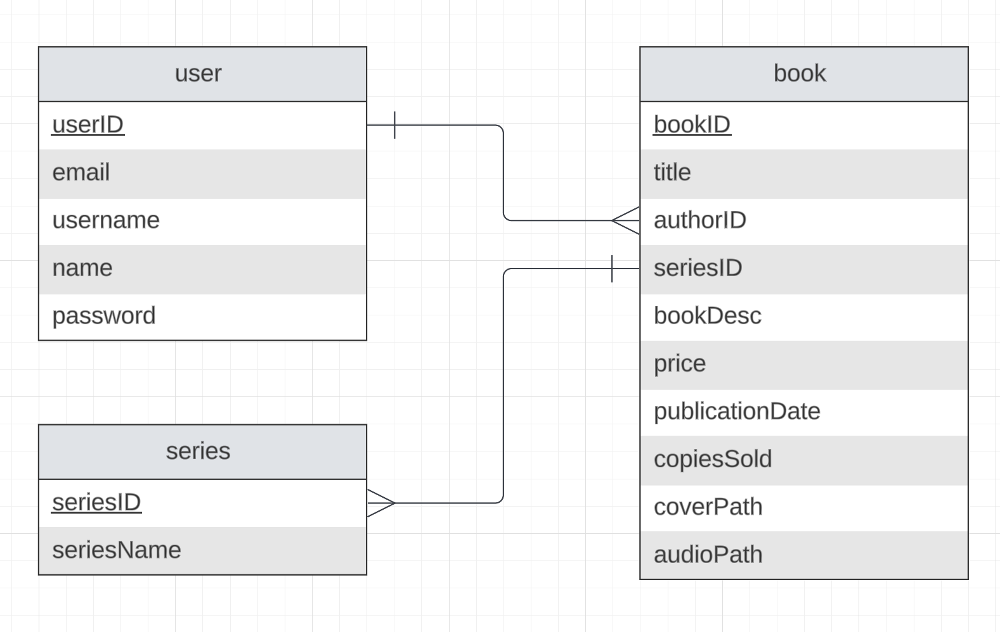

# Kinokuniya Audiobook REST Service

This repository is intended to be a REST service for the Kinokuniya Audiobook Website created with Express.ts, Prisma ORM, and PostgreSQL. This service mainly handles the CRUD operations for the books and series, along with communicating with the SOAP service to get subscriber data.

## Installation
1. Clone the repository
2. Build docker image using command located at `/script/init.sh`
3. Go to the config repository and run the command `docker-compose up -d`

## Database

## API Endpoints
### Book
Endpoint | Description | Author | NIM
--- | --- | --- | ---
`GET /api/book` | Get all books by user | Enrique Alifio Ditya | 13521142
`GET /api/book/:id` | Get book by requester id | Enrique Alifio Ditya | 13521142
`GET /api/app/book/:authorID` | Fetches all books by author | Enrique Alifio Ditya | 13521142
`GET /api/app/book/:bookID` | Fetches book by book ID | Enrique Alifio Ditya | 13521142
`GET /api/series/` | Get all series | Enrique Alifio Ditya | 13521142
`GET /api/analytics` | Get all user analytics | Enrique Alifio Ditya | 13521142
`POST /api/book` | Create a new book | Enrique Alifio Ditya | 13521142
`POST /api/series` | Create a new series | Enrique Alifio Ditya | 13521142
`PUT /api/book/:id` | Update a book | Enrique Alifio Ditya | 13521142
`DELETE /api/book/:id` | Delete a book | Enrique Alifio Ditya | 13521142

### User
Endpoint | Description | Author | NIM
--- | --- | --- | ---
`GET /api/user` | Retrieves data of authenticated user | Enrique Alifio Ditya | 13521142
`GET /api/user/check` | Checks if user is authenticated | Enrique Alifio Ditya | 13521142
`GET /api/user/authors` | Retrieves all author data | Enrique Alifio Ditya | 13521142
`POST /api/user/` | Registers new user | Enrique Alifio Ditya | 13521142
`POST /api/user/token` | Generates new JWT Token | Enrique Alifio Ditya | 13521142

### SOAP
Endpoint | Description | Author | NIM
--- | --- | --- | ---
`GET /api/subscribe` | Retrieves all subscription requests | Enrique Alifio Ditya | 13521142
`GET /api/subscribe/subscriber` | Retrieves all active subscribers | Enrique Alifio Ditya | 13521142
`POST /api/subscribe/accept` | Accepts subscription request | Enrique Alifio Ditya | 13521142
`POST /api/subscribe/reject` | Rejects subscription request | Enrique Alifio Ditya | 13521142